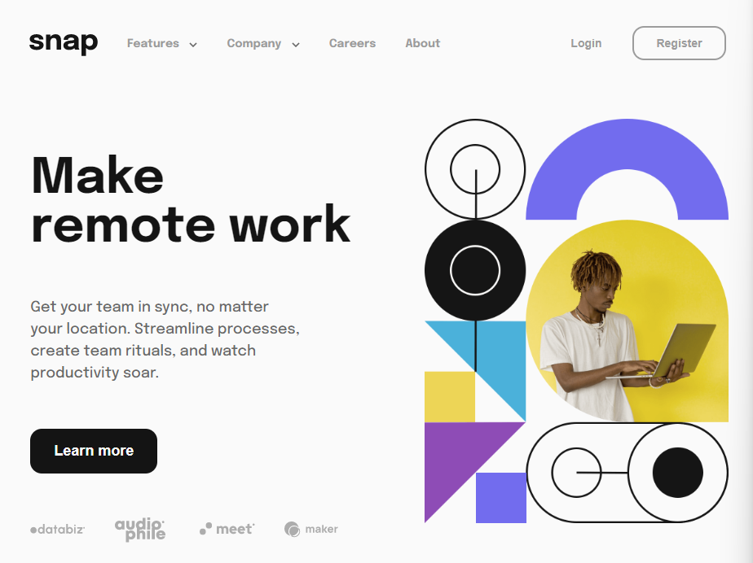

[Live Site Demo](https://souperstition.github.io/snap/)

## Table of contents

- [Built with](#built-with)
- [Purpose](#purpose)
- [Project Setup](#project-setup)
- [Media Queries](#media-queries)

## Built with

- React
  - [react-media for conditional rendering based on screen size](https://www.npmjs.com/package/react-media)
- SCSS

## Purpose

I began working on this project with two goals:

### Be able to quickly setup and complete a React project

This was one of the first React projects I ever completed, so [thinking in react](https://reactjs.org/docs/thinking-in-react.html) was a very new concept to me. I didn't have complex dreams of understanding state management or React Hooks; I just wanted to be able to churn out a project quickly and be confident about reproducing the same steps in future projects.

### Learn to work with SCSS mixins

I already had a comfortable grasp on CSS, and a good understanding of how SCSS works. I wanted to dive deeper into my understanding of why SCSS is so popular with developers - reusability. This project was a great opportunity to practice this skill.

## Project Setup

Working with SCSS in React is lovely, because you don't need to worry about compiling CSS or watching SCSS files. All you need to do is install it in your React project:

~~~bash
npm install scss
~~~

Then include the SCSS file as you normally would for any CSS stylesheet:

~~~js
import './scss/index.scss';
~~~

## Media Queries

The biggest challenge here was making sure the design looked great on any screen size. I settled on three breakpoints at which I felt the layout needed an adjustment:

- 1100px
- 900px
- 750px (at which point we would switch to the mobile design)

To write the media queries, I used a mixin that could be quickly applied when needed:

~~~scss
@mixin respond($breakpoint) {
	@if $breakpoint == large {
		@media only screen and (max-width: 1100px) {
			@content;
		}
	}

	@if $breakpoint == medium {
		@media only screen and (max-width: 900px) {
			@content;
		}
	}

	@if $breakpoint == small {
		@media only screen and (max-width: 750px) {
			@content;
		}
	}
}
~~~

Here's how easy it was in practice:

~~~scss
.hero-content {
		@include flex(column, center, flex-start, 3rem);
		padding-top: 4rem;
		height: 100%;

    // large screens and above
    @include respond(large) {
		padding: 0 2vw;

		> * {
			width: 50%;
			margin: 0 2vw;
		}
	  }
    // medium to large screens
    @include respond(medium) {
      .hero-content {
        gap: 2rem;
      }
    }
    // small screens and below
    @include respond(small) {
      flex-direction: column;
      > * {
        width: 100%;
        margin: 0;
      }
      padding: 0;
    }
}
~~~

## React Media

Media queries were sufficient for almost all layout resizing, but the main hero section image was a unique situation. For small screen sizes, there was an entirely different image, so I needed to be able to render the appropriate image accordingly. To do this, I installed the react-media package:

~~~bash
npm install react-media
~~~

Using it is quite simple: 

~~~jsx
import Media from 'react-media';

// Inside the Hero function:
{matches => }
~~~

## Style/Design Choices

These were choices I made outside the scope of the project's guidelines: 

- Animation on the mobile menu to allow it to slide in and out
- Hover effects on SVG files to change the color
- Animated hover effects to make them look smoother